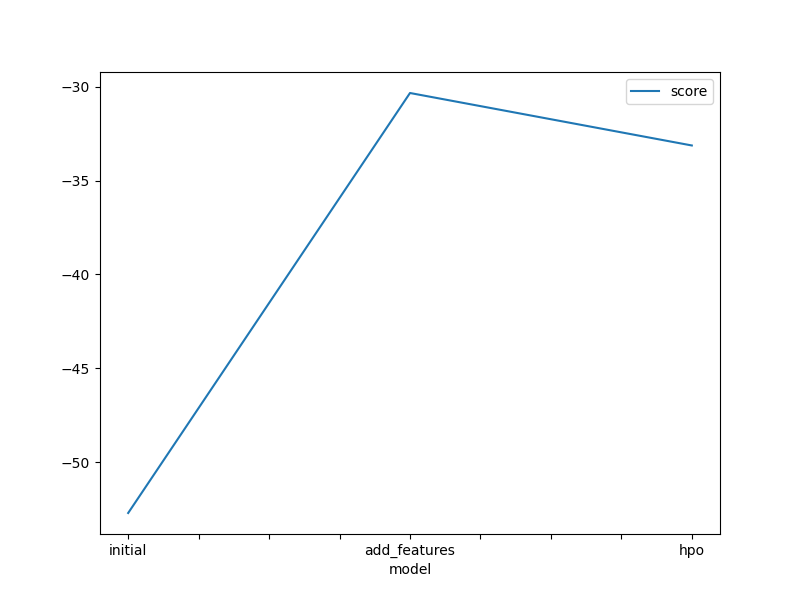
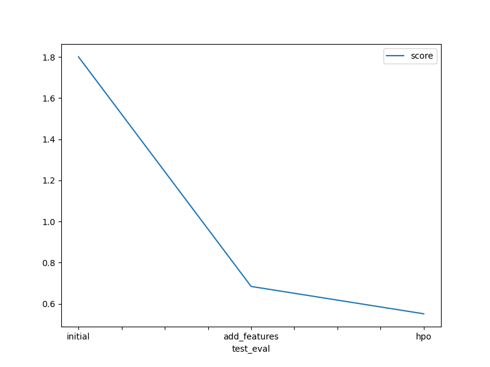

# Report: Predict Bike Sharing Demand with AutoGluon Solution
#### NAME HERE
Denis Tsvetanov
## Initial Training
### What did you realize when you tried to submit your predictions? What changes were needed to the output of the predictor to submit your results?
No initial changes were needed in order to submit the results. The predictor was fit on the data and provided a reasonable although not excellent rmse score.

### What was the top ranked model that performed?
WeightedEnsemble_L3

## Exploratory data analysis and feature creation
### What did the exploratory analysis find and how did you add additional features?
There were several columns that could be used in feature extraction. No one-hot encoding was done, altough there are columns to accomodate such changes.
Additional columns were extracted from the datetime in order to find more granular dependencies between the end result and the processes in the features.

### How much better did your model preform after adding additional features and why do you think that is?
Reduced the rmse by half. Some of the newly created columns is a strong predictor for the target, which wasn't visible with the data coupled in a single feature.

## Hyper parameter tuning
### How much better did your model preform after trying different hyper parameters?
It did better, but not significantly.

### If you were given more time with this dataset, where do you think you would spend more time?
I would research different models, or use the same ones with different params, also provide a bigger timeframe to train.
Additional feature engineering might prove beneficial too and would be my main focus.

### Create a table with the models you ran, the hyperparameters modified, and the kaggle score.
|model       |autostack |num_bag_folds|num_stack_levels|GBM_extra_trees|GBM_num_boost_round|RF_n_estimators|XGB_learning_rate|XGB_n_estimators|score  |
|--          |--        |--           |--              |               |                   |               |                 |                |--     |
|initial     |False     |None         |None            |  None         |   None            |     None      |   None          |  None          |1.80029|
|add_features|False     |None         |None            |  None         |   None            |     None      |   None          |  None          |0.68408|
|hpo         |True      | 5           | 2              |  True         |   100             |     300       |   0.05          |  100           |0.55107|

### Create a line plot showing the top model score for the three (or more) training runs during the project.

TODO: Replace the image below with your own.

### Create a line plot showing the top kaggle score for the three (or more) prediction submissions during the project.

TODO: Replace the image below with your own.

## Summary
Overall autogluon exceeded my expectations and provided a good model with an acceptable rmse score out of the bat, most notable help to the autogluon algorithms is the feature engineering done before feeding the data into the system which made the model even more accurate. Certainly insights can be gained on what model to use and it is far quicker than GridSearchCV when working with hyperparams .
